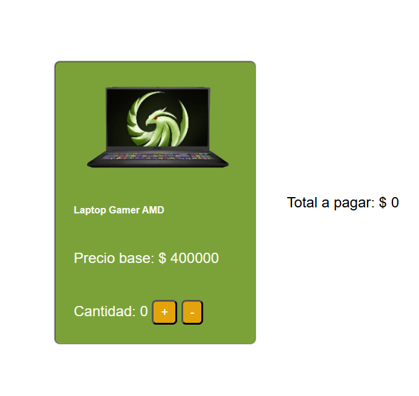

# Desafío - Calculando el Total 🛒

Este es un proyecto simple desarrollado como parte del curso "JavaScript para la Web" de Desafío Latam. El objetivo es practicar la manipulación del DOM y la gestión de eventos básicos con JavaScript.

## 📝 Descripción

La página muestra una tarjeta de producto (una laptop gamer) con un precio base. El usuario puede interactuar con botones para aumentar o disminuir la cantidad de productos que desea comprar. El precio total se actualiza automáticamente en la página según la cantidad seleccionada.

## ✨ Características

- Muestra un producto con su precio inicial.
- Permite al usuario aumentar la cantidad del producto.
- Permite al usuario disminuir la cantidad del producto.
- Calcula y muestra en tiempo real el costo total de la compra.

## 🚀 Tecnologías Utilizadas

- **HTML5**: Para la estructura básica de la página.
- **CSS3**: Para los estilos y el diseño visual de la tarjeta y la sección de total.
- **JavaScript**: Para toda la lógica de interactividad, como la actualización de la cantidad y el cálculo del total.

## 💻 ¿Cómo usarlo?

1.  Clona o descarga este repositorio en tu máquina local.
2.  Abre el archivo `base.html` en tu navegador web preferido.
3.  ¡Listo! Ya puedes empezar a sumar y restar productos para ver cómo cambia el total.

## 🖼️ Vista Previa

